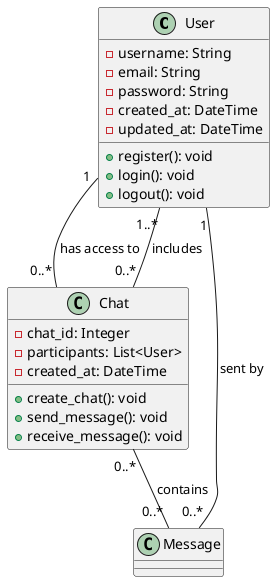

# Chat Application

Це веб-застосунок месенджера, що дозволяє користувачам реєструватися, входити в систему, спілкуватися в чатах та взаємодіяти через простий інтерфейс.

## Функціональність

### Основні функції:
1. **Реєстрація користувачів:**
   - Користувачі можуть створювати нові акаунти через форму реєстрації.
   - Необхідно вказати email, username та пароль.

2. **Вхід в систему:**
   - Користувачі можуть увійти в систему за допомогою свого username та пароля.
   
3. **Профіль користувача:**
   - Після входу в систему користувач має доступ до свого профілю та можливість змінювати налаштування.

4. **Чати:**
   - Користувачі можуть бачити список інших користувачів і розпочинати чати.
   - Можливість обміну текстовими повідомленнями.

5. **Вихід з системи:**
   - Користувач може вийти з системи за допомогою кнопки "Вийти".

## Інсталяція

Щоб запустити проєкт на своєму комп'ютері, виконайте наступні кроки:

1. **Клонуйте репозиторій:**
   ```bash
   git clone https://github.com/perogok/chat_app
   
2. **Встановіть залежності:**
   ```bash
   pip install -r requirements.txt

3. **Міграції бази даних:**
   ```bash
   python manage.py migrate

4. **Запустіть сервер:**
   ```bash
   python manage.py runserver

5. **Перейдіть до браузера за адресою http://127.0.0.1:8000.**

## Тестування

Проєкт включає базові функції, такі як реєстрація, вхід, вихід і чат. Для перевірки функціональності були створені тест-кейси.

### Тест-кейси:

#### Тестування реєстрації користувача:
- Перевірка створення нового користувача через форму реєстрації.

#### Тестування входу в систему:
- Перевірка правильності входу з коректними даними (username, password).
- Перевірка помилок при введенні неправильних даних.

#### Тестування функціональності чату:
- Перевірка обміну повідомленнями між користувачами.

#### Тестування кнопки "Вийти":
- Перевірка виходу з системи та повернення на сторінку входу.

## Архітектура

Проєкт розроблено з використанням Django для серверної частини. Між сервером та клієнтом здійснюється взаємодія за допомогою HTML, CSS та JavaScript. Всі важливі функції реалізовані у вигляді класів і функцій в Django, а також використовується WebSocket для обміну повідомленнями в чатах.

### Основні компоненти:
- **Users:**
  - Реєстрація, вхід та вихід користувачів.
  - Зберігання інформації про користувачів у базі даних.

- **Chat:**
  - Створення та управління чатами.
  - Відправка та отримання повідомлень через WebSocket.

### Структура директорій:
```
chat_app/
├── manage.py
├── chat/
│   ├── models.py
│   ├── views.py
│   ├── urls.py
│   └── templates/
├── users/
│   ├── models.py
│   ├── views.py
│   ├── urls.py
│   └── templates/
└── templates/
    ├── base.html
    ├── login.html
    ├── signup.html
    └── home.html
```

### UML-діаграма


## Інструкція з використання  

1. Запустіть програму.
2. У головному меню оберіть одну з функцій:
   - **Реєстрація нового користувача:** Заповніть форму для створення нового облікового запису.
   - **Вхід в систему:** Введіть ваш логін та пароль для входу в акаунт.
   - **Чат:** Після успішного входу, оберіть чат для спілкування або створіть новий.
   - **Вихід:** Натисніть кнопку "Вийти", щоб вийти з акаунту і повернутися на сторінку входу.
3. Дотримуйтесь підказок на екрані для введення необхідної інформації.

## Вимоги до системи  
- Python 3.x  
- Django  
- Channels
- SQLite3 (для бази даних)  
- WebSocket  

## Підтримка та оновлення  

1. **Резервне копіювання:**  
   Перед оновленням програми зробіть резервну копію бази даних для уникнення втрати даних.

2. **Оновлення:**  
   Оновіть програму до нової версії шляхом заміни файлів проєкту та виконання міграцій бази даних, якщо потрібно.

3. **Перевірка сумісності:**  
   Переконайтеся, що ваша база даних сумісна з оновленою версією програми, зокрема перевірте структуру таблиць користувачів і чатів.
