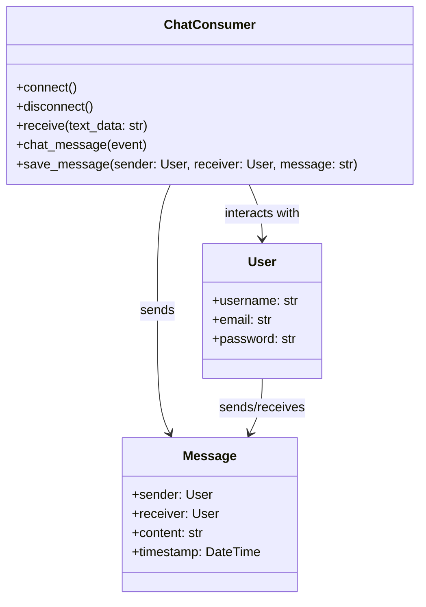

```mermaid
classDiagram
    class ChatConsumer {
        +connect()
        +disconnect()
        +receive(text_data: str)
        +chat_message(event)
        +save_message(sender: User, receiver: User, message: str)
    }

    class Message {
        +sender: User
        +receiver: User
        +content: str
        +timestamp: DateTime
    }

    class User {
        +username: str
        +email: str
        +password: str
    }

    ChatConsumer --> Message : sends
    ChatConsumer --> User : interacts with
    User --> Message : sends/receives
```